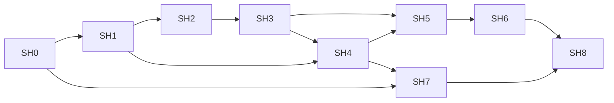

# Self-hosting on soft3

This is the working milestone contract for a Trident compiler written in
Trident, executed on **nox through Joy**, and producing executable nox programs.
It defines the route to reproducible self-compilation and then native Zheng
proofs of those compilations.

Start here when implementing the work. Read the
[progress ledger](../audit/self-hosting-progress.md) for the next task and
completed acceptance evidence. The
[2026-09-23 assessment](../audit/soft3-self-compilation-readiness-2026-09-23.md)
records the starting implementation and probes. Requirements below describe
future work; their presence does not mean the feature exists.

## Release 0.4 delivery policy

`release/0.4` is the integration branch for native soft3 self-hosting. Deliver
small, independently reviewable branches based on it, with PRs targeting
`release/0.4`. The first delivery is `feat/0.4-sh0-inventory`. Pin compatible
sibling revisions for validation; create corresponding integration/delivery
branches in an owning repository when its implementation work starts.

Keep `master` unchanged during this work. A tested delivery may enter the 0.4
integration branch without declaring the release ready. Before promoting 0.4,
complete SH6 and the existing CPU release regression/platform gates, and report
SH7/SH8 proof coverage explicitly. A proof claim additionally requires those
proof gates. No release tag or package publication follows merely from merging
an individual delivery. Version/API changes belong to reviewed implementation
or release packages; a branch name alone does not change the shipped version.

## Target and boundaries

The compiler is a deterministic program:

```text
source package + entry + options + limits
                |
       Trident compiler on nox
                |
       nox artifact OR diagnostics
```

Source packages contain exact source bytes and the full versioned dependency
closure. Language work happens inside nox: lexing, parsing, name resolution,
type checking, module linking, optimization and nox generation. The host loads
and saves artifacts, invokes the VM and records measurements. It may serialize
an already-produced noun; it must not finish compilation with a Rust backend.

The native route is `source -> typed AST -> nox formula`. Trident owns shared
language semantics and nox reference lowering. Joy owns execution, artifact
transport and proof integration. Nox owns its evaluator, data model and cost
semantics. Zheng owns the execution relation and proof verification. Soft3
owns the [composition contract](../../soft3/specs/execution-model.md).
Triton remains an independent target and optional comparison oracle.

The first compiler uses immutable native nouns with typed compiler collections,
packed/chunked bytes, explicit state and bounded operations. SH0 fixes the
source API and wire details. Application-level unrestricted recursion is not
required: bounded loops may lower to native continuations or state machines.
Ordinary calls use deterministic composition; witness calls must not delegate
compilation to a host service.

Local bootstrap requires no network, Atlas, node deployment or persistent BBG
state. Joy/nox may retain Rust implementations. Full Rust CLI/LSP parity,
other targets, GPU proving, private compilation and formal semantic preservation
have separate acceptance criteria; they are not silently included in SH6.

## Milestone map

| ID | Result | Depends on | Lead owners |
|---|---|---|---|
| [SH0](#sh0-contract-and-compiler-subset) | Exact compiler data/job contract and subset inventory | Starting assessment | Trident, Joy; nox/Zheng review |
| [SH1](#sh1-native-bootstrap-foundation) | Rust seed can build the native compiler foundation; Joy transports its data | SH0 | Trident, nox, Joy |
| [SH2](#sh2-first-native-compiler) | Compiler on nox turns supplied source into a program that Joy executes | SH1 | Trident, Joy |
| [SH3](#sh3-compiler-language-coverage) | Correctly compiles the language features used by its own implementation | SH2 | Trident |
| [SH4](#sh4-complete-project-and-runtime-scale) | Complete module closure and compiler-sized data fit the native runtime | SH1; final compiler inventory from SH3 | Trident, nox, Joy |
| [SH5](#sh5-first-self-compilation) | Compiler on nox compiles its complete own source into a usable next compiler | SH3, SH4 | Trident, Joy |
| [SH6](#sh6-reproducible-bootstrap) | Repeated self-build reaches a fixed point and runs in CI | SH5 | Trident, Joy |
| [SH7](#sh7-native-proof-relation) | Production native Zheng profile covers the chosen compiler execution model | SH0; closure requires SH3/SH4 workload | Zheng, nox, Joy |
| [SH8](#sh8-proved-self-compilation) | Native Zheng proofs authenticate the actual self-builds | SH6, SH7 | Zheng, Joy, Trident |



SH4 engineering and SH7 relation design can start early. Their final gates
use the actual compiler workload. **SH2 is the first native compiler demo;
SH5 is first self-compilation; SH6 is reproducible self-hosting; SH8 is proved
self-compilation.** Keep those claims distinct in release notes.

## Shared acceptance rules

- Every gate has a reproducible command/runner and immutable evidence. A file,
  implementation PR or passing Rust typecheck alone cannot close a gate.
- Pin source revisions, dependency closure, compiler options, machine ABI,
  runtime version, budgets and proof profile where applicable.
- Compare generated-program behavior with independent expected results.
  Rust differential agreement supplements that oracle. Include negative cases.
- Preserve the existing nox/foreign-target release regression coverage.
  Experimental syntax must not silently alter an existing target's ABI.
- Reject unsupported syntax, invalid inputs and exhausted resources explicitly.
  Failure publishes no successful or partially written executable artifact.
- Measure reductions, peak allocated nodes, memory and elapsed time. Report
  trace mode and host identity. Compare performance on the same declared host.
- Numeric limits are fixed before an acceptance run. If a limit changes,
  update its contract and rerun boundary tests; do not remove a failure by
  omitting its case or replacing the original workload with a smaller one.

## SH0. Contract and compiler subset

**Outcome:** implementation can proceed against an explicit native contract.

Work:

1. Inventory the complete `.tri` compiler/library closure: syntax, types,
   operators, intrinsics, control flow and imports. Classify each construct as
   implemented, requiring a seed extension, or requiring a compiler rewrite.
   Track the original modules and replacements so a smaller toy compiler
   cannot accidentally become the final acceptance corpus.
2. Specify source-visible native data/collection operations, their types,
   bounds, equality, field/byte encoding and persistent update semantics.
   Propagate changes to language/grammar, intrinsic signatures and nox ABI.
   [SH0.2 native data](self-hosting-data.md) fixes the target contract; SH1 must
   implement the source type and intrinsic capability together.
3. Define a versioned logical job/result schema. A job identifies source bytes,
   logical module paths, dependency identities, entry, options and resource
   limits. A result is either a complete nox artifact or structured diagnostics
   with module/span/error identity. Exact CLI spelling is implementation work.
   [SH0.3 native jobs](self-hosting-jobs.md) defines JOB1/RES1/ART1 and the
   source package. Complete noun transport is owned by nox's NOXDAG01 codec.
4. Define canonical source-package and output encodings using existing nox
   node identities. Preserve topology and exact byte lengths; reject missing
   nodes, invalid references, duplicate identities and noncanonical field words.
5. Specify bounded loop/function execution, arena policy, accounting and
   failure behavior. Agree the compiler subset and which optimizations are
   required for self-compilation; optional optimizations may start disabled.
   [SH0.4 runtime](self-hosting-runtime.md) fixes reusable native control flow,
   sequential heap-frame evaluation, resource ownership and proof boundaries.

**Accept when:** the owner specifications contain concrete types, encodings,
limits and examples; codec golden vectors distinguish `[[1 2] 3]` from
`[1 [2 3]]`; every construct in the compiler inventory has an explicit plan.
Open choices that affect implementation keep this gate open. A roadmap alone
does not close SH0.

**Receipt:** contract links, feature inventory, golden vectors and owner review
of Trident/Joy/nox/Zheng boundaries.

## SH1. Native bootstrap foundation

**Outcome:** Rust Trident can compile native data/control-flow programs needed
to implement the compiler, and Joy can run them with structured inputs/results.

Work in `trident/src/{ast,typecheck,ir/tree/lower}`, appropriate `.tri` libraries,
`nox/rs/{data,patterns,reduce.rs}` and `joy/{rs,cli}`:

- Implement SH0's collection/data operations, checked dynamic access, entry
  and result ABI, needed integer helpers and target-specific Boolean semantics.
- Lower bounded runtime loops and reusable functions without fully expanding
  their bodies for every iteration/call. Preserve returns, scope and failures.
- Address evaluator depth with explicit continuations or another specified
  bounded strategy. Preserve nox reduction/trace semantics or version changes.
- Add complete artifact transport and a counted run mode without retaining
  the whole proof trace. Enforce separate time/reduction/node/memory limits.

**Accept when:** actual nox programs round-trip structured data; execute at
least 4097 bounded loop iterations without body replication; access elements
through runtime indices; and exercise the agreed execution strategy beyond
the old 1000-frame linear-recursion obstacle. Boundary tests cover empty data,
index errors, malformed artifacts, missing fields and each resource limit.
Traced and run-only executions agree on outputs and reduction cost.

**Receipt:** executable fixtures, artifact round trips, resource measurements,
seed compiler tests and Joy runtime tests. SH4 establishes full compiler scale.

## SH2. First native compiler

**Outcome:** a compiler written in `.tri`, running on nox, reads supplied source,
emits a nox artifact, and Joy executes that artifact correctly.

Initial grammar: one `program NAME`, one `fn main() -> Field`, decimal Field
literals, parentheses, `+`, `*` and a tail expression. Define lexical/range
rules explicitly; reject valid full-language constructs outside this subset
as unsupported. Preserve precedence and associativity.

### Native compiler subset contract

The SH2 entry lives in `compiler/nox/main.tri`; reusable native stages live in
`std.compiler.nox.*`. The existing RAM compiler remains the SH3 porting input.
The pilot selects the JOB1 entry module by its complete logical-path Bytes.
Joy admits the complete JOB1 and binds the compiler identity before execution;
the guest validates the collections it consumes with one threaded allowance.
Unused modules remain identity-bound and structurally admitted without lexical
analysis. The guest discovers the direct-use closure from the selected entry
and checks each reached source in its own module scope. The requested entry
function is `main` and generated
profiles are raw `(0,0)`; other structurally admitted entry/generated-profile
requests produce diagnostics. Invalid JOB1 option values fail Joy admission.

```text
program := "program" logical_path use* declaration+ EOF
module := "module" logical_path use* ("pub"? constant)* EOF
use := "use" logical_path
logical_path := identifier ("." identifier)*
declaration := function_attribute* "pub"? function | "pub"? (constant | record_declaration)
function_attribute := "#[" ("pure" | ("requires" | "ensures") "(" contract_tokens ")") "]"
constant := "const" identifier ":" ("Field" | "U32") "=" constant_initializer
constant_initializer := decimal | logical_path | "(" constant_initializer ")"
record_declaration := "struct" identifier "{" (record_field ("," record_field)* ","?)? "}"
record_field := "pub"? identifier ":" type
function := "fn" identifier "(" parameters? ")" ("->" type)? block
parameters := identifier ":" type ("," identifier ":" type)* ","?
type := primitive_type | "(" type ("," type)* ")"
primitive_type := "Field" | "Bool" | "U32" | "Noun" | "Digest"
block := "{" statement* expression? "}"
statement := "let" "mut"? pattern (":" type)? "=" expression
           | (identifier | tuple_targets) "=" expression | "return" expression?
           | if_statement | for_statement | expression
pattern := identifier | "(" (binding_name ("," binding_name)* ","?)? ")"
binding_name := identifier | "_"
tuple_name := identifier | "(" tuple_name ")"
tuple_targets := "(" tuple_name "," tuple_name ("," tuple_name)* ","? ")"
               | "(" tuple_targets ")"
if_statement := "if" expression block ("else" (block | if_statement))?
for_statement := "for" identifier "in" decimal ".." decimal block
expression := comparison ("==" comparison)*
comparison := sum ("<" sum)*
sum := term ("+" term)*
term := bitwise ("*" bitwise)*
bitwise := postfix ("&" postfix)*
postfix := primary ("[" expression "]")*
primary := decimal | "true" | "false" | identifier | call | "(" expression ")" | tuple
tuple := "(" expression "," expression ("," expression)* ","? ")"
call := logical_path "(" (expression ("," expression)* ","?)? ")"
```

Identifiers use the seed's ASCII identifier spelling; keywords, type words,
`_` and `asm` are reserved. The declared program name must equal the requested
entry module. Whitespace is bytes 9, 10, 12, 13 and 32. `//` comments extend to
LF or EOF, retaining CR inside a comment. The complete selected source must
be valid UTF-8, including comment text; non-ASCII bytes outside comments are
invalid tokens. Spans are offsets in the exact original bytes.

Decimal tokens accept leading zeroes and values through `u64::MAX`, then
normalize modulo Goldilocks as the Rust native seed does. Larger values fail
as invalid tokens. Range checking compares significant decimal digits against
`18446744073709551615`; field accumulation alone cannot detect overflow.
Multiplication binds more tightly than addition; both associate to the left.
Generation preserves the expression tree: literal `[1 value]`, addition
`[5 [left right]]`, multiplication `[7 [left right]]`. No constant folding is
needed. The result is `ART1(0,0,0,formula)`, independent of job limits,
compiler identity, source paths and execution counters.

Local declarations infer primitive/tuple types or state an admitted type explicitly. A `let mut` binding
permits assignment; other bindings reject writes. Initializers resolve names
before installing the new binding, so `let x = x + 1` reads the previous `x`
and rejects when no previous binding exists. Same-scope shadowing creates a
fresh slot. Each assignment evaluates its right-hand side once against the
previous environment, then replaces only its selected slot. Identifier lookup
compares every source byte, including names longer than seven bytes. An identifier
followed by `(` on the same physical line is a call. LF between them
permits a following parenthesized expression where a statement boundary is valid;
CR alone keeps the same line, matching the seed parser.

The guest builds a postorder expression sequence and ordered statement sequence.
Expression records carry their complete type descriptor and source span. Addition and
multiplication require Field operands; equality requires two operands of the same
non-Noun type and returns Bool, including equality between two Unit results. Equality
binds below unsigned comparison, addition, multiplication and bitwise AND, in
that increasing order of precedence. All binary operators associate left.
Comparison and bitwise AND require U32 operands and return Bool and U32
respectively. Decimal literals retain Field type; typed U32 locals, arguments
and results require an explicit conversion or another U32 value. Native
Bool literals/results encode true as zero and false as one. Assignments and
explicit annotations preserve the binding's type; validated entry signatures are listed below.
Child references precede their parent; declarations own stable slots. Code generation uses the
actual declaration count to size a balanced native frame `[0 [0 E(h)]]`, reads
slot `i` at axis `7 * 2^h + i`, and composes persistent frame updates in statement
order. Statement-free arithmetic retains its existing formula bytes. Requested
limits may reject work but do not select a different successful artifact.

Blocks own explicit ordered statement lists and an optional tail expression.
If is a statement. Initializers such as `let x = if ...` remain unsupported.
Only the function tail and the tails of its terminal if/else branches become
returns; an intermediate branch evaluates and discards its tail. Explicit return
exits the whole function. Every branch is parsed and type checked, including an
unselected branch. Statements after a direct return are rejected as unreachable.
Return coverage follows the seed: literal conditions select their known arm;
otherwise both arms must return, or a later statement must cover continuation.
Conditions accept Bool and raw Field using the nox convention: canonical zero
selects then. Types and return coverage reject with semantic diagnostic5.

Branch scopes restore the previous bindings on exit, while allocated runtime
slots remain unique across the function. Writes to a visible outer mutable
binding survive; branch-local declarations do not escape. The parser uses a
bounded stack of block continuations. Block and statement arenas retain explicit
ownership and postorder child references. Nested bodies never share a presumed
contiguous statement range.

Generated block flow uses Continue `[0 subject]` and Return `[1 value]`, matching
the native runtime contract. A continuation executes once against the updated
subject; Return bypasses it. The nox branch evaluates only its selected arm.
Successful arithmetic and linear Field-local programs retain their existing
artifact bytes. Nested control uses its own bounded flow generator; every new
collection and parser continuation is charged to the requested sequence limit.
The block nesting ceiling is 64, further restricted by that limit. Exceeding
known capacity returns diagnostic7 before the corresponding append.

Functions are ordinary module-local declarations. A header pass gathers complete
names, typed positional parameters, result types and token-delimited body spans
before any body is checked. This permits forward calls. The last declaration of
a function name supplies its callable binding, matching the seed; every declared
body is still checked against its own signature. Calls resolve in the function
namespace, so a local with the same name does not replace the callable binding.
Parameters are immutable and occupy distinct positional slots. Repeated parameter
names retain their arity and select the last parameter during name lookup.
The selected last `main` must have the scalar or structured signature below.

An omitted result annotation means Unit; Unit has no explicit type spelling in
this subset. Unit functions may fall through and produce native atom zero.
Bare return is accepted only for Unit. Explicit and terminal return values must
match the declared result, except a resolved builtin `assert(false)` which
halts before producing a value. Local inference can retain Unit values; assignment
preserves that type. Conditions still require Field or Bool. Generic and
intrinsic declarations remain outside this subset. Direct ordinary imports
follow the module rules below.

The scalar unqualified builtins are: `as_u32(Field) -> U32`,
`as_field(U32) -> Field` and `sub(Field, Field) -> Field`. Final user function
bindings take precedence over builtin names, including forward declarations;
local variables do not replace callable bindings. Builtins do not enter the
function graph or code table. Every argument is type checked and evaluated
once in source order. Qualified names require future import resolution.

`as_u32` checks that its evaluated Field argument is less than 2^32. Failure
traps during execution of the emitted program through `inv(0)`; compiling that
well-typed program succeeds. `as_field` preserves the underlying atom and
`sub` subtracts modulo Goldilocks. The nox formulas use tags 10, 12 and 6 for
unsigned comparison, bitwise AND and subtraction. Conversion evaluates its
argument once as a new subject, branches on the range check and either retains
that atom or traps. Formula-depth accounting includes the complete guard and
continuation. Accepted earlier no-builtin programs retain their artifact bytes.

`assert(Bool) -> Unit` and `assert_eq(Field, Field) -> Unit` evaluate their
arguments once in source order. Success produces atom zero; failure traps
through `inv(0)` during execution of the emitted program. Well-typed failing
assertions compile successfully. Final ordinary functions with these names
retain callable precedence; local variables cannot replace callable bindings.
The formulas branch on the evaluated Bool or Field equality, without a helper
code-table entry. Complete depth includes the failure arm and branch wrappers.

Only a resolved builtin `assert` whose sole argument is the literal `false`
(possibly grouped) supplies compile-time halting coverage. It may stand alone,
end a block or appear as an explicit return value of any declared type.
Direct following statements or a tail expression in that block are unreachable
errors. Halting coverage propagates through branches and known nonempty loops;
their defensive continuation remains permitted, as in the seed. Computed false
conditions, unequal `assert_eq` calls and assertions inside let initializers do
not establish halting coverage. Ordinary functions named `assert` retain their
declared result and normal return-coverage rules.

Function prefixes accept `#[pure]`, `#[requires(...)]` and `#[ensures(...)]`
before optional `pub`, including repeated attributes. Contracts contain raw
lexer-token metadata with balanced parentheses, as in the seed: empty payloads,
unknown names and incomplete expressions are accepted. They add no runtime
assertions or emitted code and are not expression-typechecked. This compiler
recognizes their source syntax; it does not preserve an audit AST or establish
their formal truth. Metadata scanning is bounded by source length and uses
no expression-stack nesting quota. Exact `asm` tokens remain unsupported until
the guest implements the seed's special assembly lexer.

Each function declaration retains its own `pure` flag, including declarations
whose callable binding is later replaced. A pure body rejects direct calls whose
names the seed classifies as I/O: prefixes `pub_read`, `pub_write`, `divine`, and
exact `sec_read`, `sponge_init`, `sponge_absorb`, `sponge_squeeze`,
`sponge_absorb_mem`, `ram_read`, `ram_write`, `ram_read_block`, `ram_write_block`,
`merkle_step`, `merkle_step_mem`. This name check also applies to ordinary source
functions and does not infer transitive effects through helpers. These flags are
declaration metadata; the existing packed signature format remains unchanged.
Attribute prefixes on constants/structs are syntax errors. A `#` outside a
function prefix, including before `program`, after `pub`, inside parameters,
bodies or constant initializers, retains its unsupported diagnostic. Unknown
attributes and unsupported forms such as `pure()`, `cfg`, `test`, `intrinsic`
diagnose as unsupported. Malformed supported delimiters are syntax errors;
invalid lexical tokens retain lexical diagnostics.

The native subset admits opaque Noun parameters, results and local bindings.
A Noun frame slot retains a complete immutable subtree. Two entry signatures
are accepted: the existing `main() -> Field`, and
`main(input: Noun) -> Noun`. The latter receives the original runtime subject
in its first parameter, in both standalone and table-dispatched programs.
Generated ART1 profiles remain raw `(0,0)`; a structured entry alone does not
request or establish the compiler JOB1/RES1 profile.

Six direct nox builtins use their existing seed names:
`nox_noun_atom(Field) -> Noun`, `nox_noun_pair(Noun,Noun) -> Noun`,
`nox_noun_head(Noun) -> Noun`, `nox_noun_tail(Noun) -> Noun`,
`nox_noun_as_field(Noun) -> Field`, and `nox_noun_eq(Noun,Noun) -> Bool`.
User function bindings retain precedence. Arguments are evaluated once in
source order; pair construction preserves both subtrees, and equality compares
their native identities. Head and tail require a pair; as_field requires an
atom and retains its runtime shape check. Invalid projections compile when
well typed, then trap only when the emitted program reaches them.

Noun arithmetic, ordering, bit operations, indexing and the `==` operator
remain rejected; `nox_noun_eq` supplies explicit native equality. Conditions
remain Field/Bool. Qualified calls require actual module/import resolution.
Compiler-profile generation remains a subsequent increment. Earlier scalar-entry programs retain their ART1 bytes.

Compiler-owned type descriptors are canonical Noun values. Primitive tags
Field/Bool/Unit/U32/Noun retain atoms0/1/2/3/4; atom5 marks an invalid type and
atom6 is Digest. AST, binding and signature records store the complete
descriptor. Native identity compares types independently of temporary arena
indices and definition order. Primitive tests use their explicit tag atoms.

The tuple constructor owns ordered child descriptors and derives logical depth,
logical node count and recursive contains-Noun metadata. Logical nodes count
repeated occurrences even when the canonical DAG shares their representation.
Accessors and child arguments consume descriptors made by the compiler's type
constructors; external modules supply source bytes. Type construction
obeys the requested sequence allowance, a 64-level nesting ceiling and a guest
arity ceiling16. Zero-child and invalid-child descriptors reject. Composite
construction failures cannot produce a valid descriptor. Equality eligibility
reads contains-Noun; nested Noun components stay outside the ordinary equality
operator.

Nominal descriptor infrastructure uses tag17 with the same derived metadata
envelope as tuples: `[17 [[owner-Bytes [name-Bytes fields-Seq]] metadata]]`.
Each ordered field is `[name-Bytes [type public-flag]]`, where flag1 is public
and flag0 is private. Identity retains complete defining-module and declaration
names, field order, visibility and child descriptors; aliases, source spans and
temporary registry indices do not define it. Name bytes are canonical owned
Bytes values. Lexical spelling belongs to the eventual source frontend.

The nominal constructor accepts empty records and at most32 fields, independently
of tuple arity16. It derives logical nodes as1 plus all child occurrences,
depth as1 plus maximum child depth (empty depth1), and recursive contains-Noun.
Requested type-node and depth allowances still apply. Empty owner/type/field
names, duplicate field names and invalid child types return semantic status5;
field-count/node/depth exhaustion returns status7. Success returns status0 and
the complete descriptor. For a member failure the result retains its field index.
Accessors consume fields/descriptors made by these compiler constructors.

Field lookup compares the complete name and returns its index/type, whether it
exists, and whether access is permitted. A public field is visible from any
module; a private field is visible only to its defining owner. A known primitive
or tuple descriptor has no nominal fields. Nominal records remain distinct from
tuples for destructuring. This foundation provides internal data and visibility
checks. Module-local source syntax is described below; actual import resolution
and cross-module source-level privacy acceptance remain subsequent gates.

The bounded native source compiler admits module-local nominal declarations
`[pub] struct Name { [pub] field: Type, ... }`, including empty layouts and
trailing commas. Names retain complete source spelling. Duplicate declarations
and fields reject with diagnostic5; up to32 fields and the requested registry,
logical type-node and depth allowances apply independently. The current
module's logical JOB1 name owns each descriptor. Type export visibility is
stored separately from each field's visibility.

Field types and ordinary function signatures resolve against declarations
preceding them in source order. Every function body then sees the final
immutable type registry. This admits later types in local annotations and
constructors while rejecting forward/self-recursive layouts and earlier
signatures referring to later types. Unknown named types produce diagnostic5.
`Unit` remains available as a nominal declaration name; primitive Unit still
has no explicit source spelling. Public local functions retain normal callable
binding behavior. Cross-module nominal exports/imports remain a later gate.

Constructor recognition follows uppercase final names and named-field syntax.
Each required field appears once, in explicit `name: expression` or shorthand
`name` form; missing, extra, repeated and mistyped values reject. Constructor
expressions execute exactly once in declaration order, regardless of their
textual label order. Complete values form a zero-ended cons-list, including
empty records (zero), nested records, Digest and Noun subtrees. Each
record occupies one native slot. Ordered links own initializer AST IDs; source
order does not implicitly define the emitted record layout or evaluation order.
The constructor decodes its trusted layout once into an owned field list and
keeps initializer IDs in a bounded indexed tree. Empty leaves are zero; occupied
leaves encode ASTid+1. Resuming a constructor preserves this private continuation
without revalidating public sequence handles at each delimiter. External Seq
and Bytes admission retains its existing validation.

Postfix `.field` reads work on locals, calls, constructors and parenthesized
bases, preserving complete field types and evaluating the base once. Lookup
checks both existence and defining-owner/public visibility. Delimiter-owned
constructor contexts permit constructors inside groups/calls/index expressions
even when an outer condition precedes a block. Qualified import/type resolution
remains a subsequent increment.

Static field assignment `local.field[.field...] = expression` requires a
mutable local root, an existing visible field at each selection, and an RHS
with the selected field's exact type. Whole nominal, tuple, Digest and Noun
fields retain their complete values. Parameters and immutable/shadowing locals
cannot be changed. Constructor and call results cannot be assignment roots;
Digest indexed writes and field targets in tuple assignment remain outside
this increment.

The RHS executes once against the old environment. Persistent reconstruction
changes the selected root slot while preserving snapshots, sibling fields and
other frame slots. Typed projection links retain the stable root slot; field
paths use separate relative axes, allowing combined paths longer than one
machine axis. Rebuilding each parent reads only its original value. The full
replacement expression and ordinary WRITE consume AST/statement allowances;
their actual formula depth is checked independently. The bounded walk admits
up to64 field selections, additionally constrained by nominal type depth.

Module constants admit `const name: Field = initializer` and `U32`, with optional
`pub`. Initializers are integer literals or exact-type local/imported constant
references; parentheses may group either. The final declaration of each full name is frozen
before checking function bodies. Forward references are valid; unknown names,
cycles, type mismatches and invalid initializers fail even in replaced or unused
declarations. Final visibility belongs to the final declaration. U32 literals are
checked against their raw decimal value before Field reduction. Alias chains
share the terminal literal's normalized value and original decimal span.

Constants have an independent declaration allowance within the requested AST
capacity. Resolution uses bounded iterative memoization; initializer grouping
uses the expression nesting allowance. Locals and parameters shadow constants;
constants cannot be assignment targets. Emission quotes their typed values.
Their expression nodes remain distinct from literal nodes: `[7][I]` with
`const I: Field = 18446744069414584321` reads element0, whereas the same raw
literal index rejects. Known constant Field conditions use zero-as-true coverage.
Constants in array extents and loop bounds remain outside this increment.
Scalar signatures therefore require no additional source pass before final
constant resolution.

The first guest import slice compiles a reachable package of Field/U32 constant
modules. C1 validates each reached source/header once, discovers direct uses,
rejects missing owners/cycles, and publishes dependencies in deterministic seed
order before checking the entry. All dependency declarations are checked,
including replaced/private ones; only final public bindings enter import views.
Full paths and short module basenames retain per-symbol source order, including
repeated uses. Local variables shadow a module root; module-level constants do
not. A module sees only its direct imports. Foreign definitions retain their
own source coordinates; terminal literal provenance follows every alias while
expression nodes retain the caller's full qualified span and normalized value.

A checked entry without uses compiles directly without allocating a graph. A
self-use still enters discovery and reports a cycle. Dependencies currently
admit constants and ordinary functions with scalar Field/Bool/U32 parameters
and scalar or Unit results. Qualified calls resolve direct public imports;
private helpers retain their own module scope. All bodies are checked, including
replaced declarations. Dependency structs, nominal signatures and intrinsics,
qualified constructors/types, legacy path remaps and generated compiler-job
profiles remain subsequent work.
All reached sources share the existing4096-byte ceiling; import support does
not imply compiler-scale memory or a complete self-build. The detailed contract
is [native compiler jobs](self-hosting-jobs.md).

Fixed Field arrays use `[Field; N]` annotations with a raw decimal extent.
Empty `[]`, singleton and trailing-comma literals produce zero-ended lists of
complete Field values, evaluated once in source order. Array descriptors use
tag18 and the common metadata envelope: `[18 [[Field length] metadata]]`.
Depth is1 and logical nodes are1+length; the requested type allowance is checked
before growth. Arrays have their own identity, distinct from tuples and Digest.
Annotations work in existing local, parameter, return, tuple and record positions.
Whole-array equality, mutable-local replacement and static record-field
replacement retain exact type checking and persistent snapshots.

Array reads accept Field/U32 indices. The base executes first, then the index,
each once. A literal index is checked against the static length using its raw
u64 spelling before Field normalization: `[7][18446744069414584321]` rejects
with diagnostic5, while `[7][18446744069414584321+0]` reads element0. Dynamic
indices check the length at runtime and trap with InvZero outside it. Digest
index behavior is unchanged. A single reusable Get helper follows source
functions and loops in the code table, present only when a reachable function
contains an array read. The helper walks list cells with a decremented index;
its formula has constant size, while runtime reductions and frames grow with
the accessed index. Array literals alone require no helper.

Non-Field elements, nested arrays, symbolic/compound extents, repetition syntax
and element writes remain outside this increment. The expression-first parser
can report a literal-read error before reaching an assignment token. Owned
array delimiters, argument links, AST nodes, logical types, code-table entries,
formula depth and runtime resources each retain their independent allowances.
Checked-body transport retains source metadata for planning and restores a
compact emission record. Source parser scopes and continuations end before
emission; transported public sequences retain full admission checks.

Digest is primitive descriptor6 and occupies one complete native frame slot.
`nox_noun_identity(Noun)->Digest` evaluates its argument once and returns the
balanced native identity `[[a b][c d]]` through axis0. Digest equality compares
complete values. Digest parameters, results, locals and whole-value assignments
use the existing type rules; public entry signatures remain unchanged.

Read indexing `digest[index]` accepts Field or U32 and returns Field. The base
executes once before the index executes once, including discarded reads and
unused arguments. Both literal and computed indices are checked at execution:
values0..3 select the four components, other canonical field values trap with
InvZero. Decimal Field normalization happens before indexing. Index brackets may
follow across a newline, and nested call/group/index delimiters own their stacks.
Invalid types and malformed delimiters fail compilation before publication.
Digest indexed writes and actual imports remain outside
this increment. Runtime, parser stack, AST and formula-depth bounds are separate.

Tuple source types are ordered canonical descriptors. Type syntax admits
`(T)` as a singleton and `(T,U,...)` with no trailing comma; empty type tuples
reject. Annotations in locals, parameters and results use the same iterative
bounded parser. Tuple parameters each occupy one native frame slot. The
primitive Unit type has no explicit spelling; inferred Unit components retain
their zero leaf. Tuple values require at least two expressions and allow a final
comma; `(x)` preserves grouping, while `()` and `(x,)` reject. Components execute
once in source order, preserving complete nested Noun/tuple/Digest values in a
zero-terminated cons-list. Equality requires identical descriptors and no
recursive Noun component. Group, tuple, call and index delimiters keep distinct
owned continuation frames and child links.

Flat destructuring declarations `let mut? (name|_,...) (:T)? = expression`
check component count and optional full annotation, evaluate the complete RHS
once into a hidden slot, then bind named components in source order. `_` discards
a component after evaluating the RHS. Repeated names leave the last binding
visible. Tuple assignment `(a,b,...) = expression` requires existing mutable
variables with matching component types. Its RHS reads the old environment
before any ordered writes; repeated targets receive the last assigned component.
Tuple projections follow cons-list axes, while Digest destructuring requires
exactly four names and selects its balanced limbs. Tuple read/index syntax and
nested destructuring patterns remain outside the subset. Hidden slots,
projection expressions and writes consume ordinary compiler sequence quotas;
node, arity, nesting, formula-depth and runtime limits remain independent.
The guest reserves one hidden RHS slot and slots only for named let components;
discarded components consume no projection or write record. Bare `let _` and
parenthesized single-name assignment retain their previous unsupported status.

Literal-range loops admit `for name in A..B { body }`, where A and B are
unsigned decimal literals, A is at most 2^32−1 and B is at most 2^32.
The guest checks their raw source digits before Field normalization, including
empty ranges; larger lexically valid literals receive semantic diagnostic 5.
Overflow beyond the unsigned 64-bit lexical domain retains diagnostic 1. The same literals
in ordinary expressions retain the existing Field normalization. End is exclusive;
empty and reversed ranges execute no body iterations. Dynamic ranges, outer-index
bounds and `bounded` annotations remain outside this guest increment.

Each loop introduces an immutable U32 index in its child scope. Its body can
mutate outer bindings, declare locals, call functions and contain nested loops.
Index and child locals do not escape. The loop body is type checked even when
empty or unreachable. A body tail is evaluated and discarded. An explicit return
propagates through all enclosing loops to the current function; a helper return
still exits only that helper. A body that returns on every path supplies function
return coverage only when A<B and B<=2^32−1, matching seed coverage. Other ranges
need a following return/tail. Following fallback statements remain accepted.

The immutable code table stores each reachable function and each of its loop
bodies once. Generated loop dispatch is separate from source-call recursion.
Runtime state retains an index and remaining-candidate count; the last candidate
finishes before incrementing the index, including index 2^32−1. Loop count does
not unroll or duplicate the body formula. Source, sequence, table, output depth
and execution quotas remain independent; no constant-memory execution is promised.
Programs without loops retain their previously accepted ART1 bytes.

The expression parser tracks call delimiters and argument ownership explicitly.
Nested calls own separate argument lists; argument records need not be contiguous
in the expression arena. Arity and each positional type are checked. The function
call graph includes calls in unselected branches; direct and mutual cycles among
final callable bindings are rejected, including unused functions. Shadowed bodies
are checked, while only the final binding contributes to the seed's cycle graph.
Cycles, unknown calls and wrong arity/type use semantic code5; code4 remains
reserved for import cycles by JOB1.

Only functions reachable from main enter the runtime code table, ordered by their
complete ASCII name within the selected module. A sorted table and body/slot plans
make generated bytes independent of declaration discovery order for the same
final callable definitions, and of unused well-typed bodies. A declaration's
locals are planned before any call is emitted.
The [runtime contract](self-hosting-runtime.md#source-execution) defines one body
per reachable function, immutable balanced code tables, and a fresh balanced
frame per call. Arguments evaluate once from left to right. Native dynamic apply
is `[2 new_subject code_producer]`; quoting the code producer would change its
meaning. A callee return unwraps at its function boundary and resumes its caller.
Existing single-main programs without calls retain their accepted artifact bytes.
Function headers, parameters, argument links, stored body arenas, graph states
and traversal frames obey explicit sequence capacities before growth. The call
graph traversal has a 128-function depth ceiling, further restricted by the
requested sequence limit; the root occupies one level. Source
ceilings remain independent of the lifetime arena; complete scale is SH4 work.

The compiler reports the first deterministic diagnostic: code 1 for encoding or
tokens, 2 for malformed syntax, 3 for an entry mismatch, 5 for a recursive call
cycle, unknown expression name, immutable assignment or type/return error,
6 for an unsupported construct/request and 7 for a known compiler work-capacity
limit. A single diagnostic respects every admitted
positive diagnostic cap. UTF-8 validation precedes parsing. Unsupported
import forms, declarations other than functions/structs/constants, and other attributes are rejected,
including trailing items.
Exhaustion of a VM or collection-validation allowance remains an execution
failure outside RES1, as specified by the job contract.

Source, token and stack ceilings bound the pilot's algorithm; executable
acceptance must record their concrete values and boundary cases. They are
admission ceilings, not a promise that every input under them fits the
independent nox arena, reduction and evaluator-frame limits. SH4 measures the
complete compiler workload. An iterative operator/value stack avoids recursive
descent; helper chunks return explicitly to release evaluator frames.

The initial ceilings are 4096 selected source bytes and 64 live entries in
each operator/value stack, further restricted by the requested sequence cap.
Expression records, statements and binding tables each obey the lesser of the
requested sequence cap and the selected-source ceiling; every append checks
capacity before modifying the collection.
At most 4096 nonempty tokens and 4096 operator reductions fit the 8192-step
parser driver. UTF-8 validation uses 64-byte chunks; parsing uses 32-step
chunks; body parsing and expression/statement emission use eight-record chunks
with explicit completion. Generated formula depth plus its ART1/RES1 wrappers must fit the
requested artifact depth. The guest JOB reader charges every record projection,
collection traversal and repeated admission payload read to its shared visit
allowance; lexical and parsing reads use the execution budget after admission.

Acceptance procedure:

1. Rust Trident builds this compiler to `C1.nox` once.
2. After that build, supply separately packaged source inputs such as
   `program sample fn main() -> Field { 2 + 3 * 4 }`.
3. Joy executes C1 on the package. C1 performs lexing/parsing/checking/native
   generation and returns a complete formula; the host only encodes/saves it.
4. Joy loads the returned artifact and executes it. This example returns 14;
   `(2 + 3) * 4` returns 20. Compare an independent oracle and Rust-generated
   programs on the same source.
5. Repeat with generated literals/whitespace/identifiers supplied after C1 was
   built, plus malformed delimiters, trailing tokens, unknown names and
   unsupported declarations. Errors must not produce a runnable artifact.

**Accept when:** the runner records both native executions and their artifact
identities, and demonstrates that Rust parsing/typechecking/lowering and Triton
execution are absent from the compilation after the seed build. An arithmetic
answer or TIR dump without an executable output cannot satisfy this gate.

**Receipt:** compiler source, fixed C1 identity, input corpus, emitted programs,
commands, expected/actual outputs, negative diagnostics and resource totals.
This stage does not claim that C1 can compile its own implementation yet.

## SH3. Compiler language coverage

**Outcome:** native compilation covers the complete language subset used by
the production-intended self-hosted compiler and its dependency closure.

Adapt the existing lexer/parser/typechecker algorithms to native collections.
Repair multiple-item/child-list connectivity and implement direct typed
AST-to-nox generation in `.tri`, using the Rust nox backend as a reference.

**Accept when:** the feature inventory maps every used construct to passing
positive and rejection cases. At minimum cover local/mutable variables,
shadowing, qualified names, multiple functions, parameter/return types,
conditionals and early returns, bounded loops, chosen aggregates/collections,
dynamic access, constants and imports. Include declarations/attributes/generics
actually used by the compiler. Narrower required subsets must be explicit.

Required regressions include `let x: Field = 7 x`, two-parameter calls and
distinct `helper() -> 7` / `main() -> 9` bodies. Unsupported constructs and
wrong types reject; identifiers use checked symbol identity rather than an
unchecked short hash. Results are tested by executing emitted nox programs.

**Receipt:** updated feature matrix, independent/differential corpus results,
negative diagnostics and module-stage invariants. Self-source exercises join
the corpus as dependencies become supported; SH5 requires the full closure.

## SH4. Complete project and runtime scale

**Outcome:** source/module loading and native data processing support the whole
compiler at measured, declared resource limits.

- Resolve all imports from the supplied package, with deterministic logical
  paths and dependency order. Reject missing, ambiguous, cyclic/unsupported or
  identity-mismatched modules according to the language contract.
- Exercise source scanning, AST construction, symbol lookup, persistent updates
  and output transport at 4 KiB, 64 KiB and at least the full current compiler
  closure size. A stub-only/synthetic project does not replace that closure.
- Measure complete lifetime allocation, including input, compiler formula,
  AST, environments, intermediates and output. Prove limits by checks; do not
  assume a larger reduction budget provides more arena or call capacity.
- Define reference-host budgets before the final run. Validate exact-bound and
  exceeded-bound behavior without partial results or unbounded trace storage.

**Accept when:** the real compiler project resolves and its data-intensive
stages complete under those budgets; artifact decoding preserves all output;
changing a dependency changes the package identity. Reordering package entries
or changing checkout directory preserves deterministic compilation semantics.

**Receipt:** complete module/source manifest, workload sizes, peak nodes/memory,
reductions/time, resource failures and canonical artifacts. Re-estimate the
remaining effort from these measurements before SH5.

## SH5. First self-compilation

**Outcome:** C1 running on nox compiles its complete source S into C2.nox.

Freeze S, including libraries, nox generator, options and selected ABI. Build C1
with the Rust seed; then run `C1(S)` entirely on nox. Save C2 as an independently
loadable artifact. Execute C2 to compile the SH2/SH3 positive and negative
corpus, and execute those emitted programs against independent expectations.

**Accept when:** C2 is the compiler generated from all of S, and performs those
compilations successfully. No host-generated replacement code, frozen AST or
cached prebuilt C2 may substitute for the native compiler's output.

**Receipt:** S manifest, Rust seed identity, C1/C2 artifacts, native compilation
measurement, C2 corpus results and exact reproduction commands.

## SH6. Reproducible bootstrap

**Outcome:** the self-built compiler reproduces itself and the gate runs in CI.

Run `C2(S) -> C3` with the same frozen source closure/options. Compare canonical
executable bytes and behavior-affecting metadata of C2/C3. Record producer
identity, timestamps and host paths separately in receipts so they do not make
the executable self-referential. Do not normalize away instruction/data changes.
C1 may differ because the Rust compiler uses different optimizations.

**Accept when:** C2 equals C3 under that exact comparison, C3 compiles the
regression corpus correctly, and clean bootstrap reproduction succeeds on the
six supported CPU release targets: macOS, Linux glibc and Windows MSVC, each
on ARM64 and x64. Record missing platform evidence as an open gate.

CI pins the source closure/seed and invokes one documented bootstrap runner.
Its command and artifact paths are added to the ledger when implemented;
this specification does not advertise an existing bootstrap CLI command.

**Receipt:** C2/C3 comparison, corpus results, six-target matrix, CI run and
downloadable source/seed/artifact identities. This closes reproducible native
self-hosting; it does not certify source-language semantic preservation.

## SH7. Native proof relation

**Outcome:** a production Zheng profile covers the compiler's execution model
and declares its exact disclosure, cost, size and verification properties.

Design may start at SH0. Final acceptance uses SH3/SH4 programs and measurements.
Specify and implement the required dynamic continuation/data-shape behavior,
authenticated memory/state transitions and a bounded/chunked proof strategy.
If chunking is used, bind order, boundary states and final completion to one job;
dropped, reordered or substituted chunks must reject.

**Accept when:** Joy dispatches to the production native profile and an
independent verifier authenticates pilot compiler workloads. Tests mutate the
compiler formula, source/dependency/options bindings, output tree topology and
payload, execution cost and selected continuations. Wrong bindings reject.
The dynamic-apply example in the starting audit must have an explicit supported
native proof path. Experimental circuit tests alone do not close this gate.

**Receipt:** normative relation/profile version, production dispatch/verifier,
positive and adversarial pilot proofs, limits and measured proving resources.
A full-witness public proof may satisfy the declared profile; succinctness and
zero knowledge require separate evidence. Triton-backed JOYZK003 is a distinct
profile and does not satisfy this native milestone.

## SH8. Proved self-compilation

**Outcome:** native Zheng proofs authenticate both actual self-builds
`C1(S) -> C2` and `C2(S) -> C3` recorded at SH6.

Bind the exact compiler, complete source/module/options package, output
artifact, machine/profile versions and execution cost. Commitments must be
checked against the data used inside the relation; metadata alone is insufficient.
Verify in a fresh process without rerunning the compiler or using a Triton
prover/checker. Repeat the adversarial bindings from SH7 on these artifacts.

**Accept when:** valid proofs verify, altered jobs/artifacts reject, C2/C3
remain equal and the generated compiler still passes its regression corpus.
Record proof generation/verification time, memory, size and disclosure.

**Receipt:** both compilation proofs, standalone verification commands and
receipts, bound artifact identities, rejected mutations and regression results.
Proof of execution establishes that this compiler ran; a semantics-preservation
proof or translation validation is a further, separately specified milestone.

## How to execute this roadmap

Use the [ledger](../audit/self-hosting-progress.md) as the session entry point.
Take the first ready unchecked task, keep changes with their owning repository,
and update the relevant contract before changing an ABI or language rule.
Complete one executable acceptance slice at a time; integrate cross-repo changes
against pinned compatible revisions.

For every completed gate, store a dated receipt under `audit/self-hosting/` or
link immutable owner-repo evidence. A receipt records milestone/case IDs,
revisions and patches, exact commands, input hashes, exit codes, expected and
actual results, artifact identities, resource metrics and limitations. Link
failures as well as successes. An implementation commit without its acceptance
evidence stays open.

Update the ledger's next action and blockers after each session. Mark a gate
done only when every acceptance condition is met; reopen it when a regression
invalidates its evidence. Keep planning estimates in the ledger and observed
measurements in receipts. Writing or reorganizing these documents completes no
implementation milestone and changes no Kelvin readiness value.
