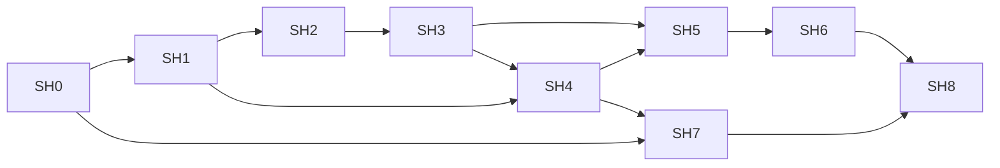

# Self-hosting on soft3

This is the working milestone contract for a Trident compiler written in
Trident, executed on **nox through Joy**, and producing executable nox programs.
It defines the route to reproducible self-compilation and then native Zheng
proofs of those compilations.

Start here when implementing the work. Read the
[progress ledger](../audit/self-hosting-progress.md) for the next task and
completed acceptance evidence. The
[2026-09-23 assessment](../audit/soft3-self-compilation-readiness-2026-09-23.md)
records the starting implementation and probes. Requirements below describe
future work; their presence does not mean the feature exists.

## Release 0.4 delivery policy

`release/0.4` is the integration branch for native soft3 self-hosting. Deliver
small, independently reviewable branches based on it, with PRs targeting
`release/0.4`. The first delivery is `feat/0.4-sh0-inventory`. Pin compatible
sibling revisions for validation; create corresponding integration/delivery
branches in an owning repository when its implementation work starts.

Keep `master` unchanged during this work. A tested delivery may enter the 0.4
integration branch without declaring the release ready. Before promoting 0.4,
complete SH6 and the existing CPU release regression/platform gates, and report
SH7/SH8 proof coverage explicitly. A proof claim additionally requires those
proof gates. No release tag or package publication follows merely from merging
an individual delivery. Version/API changes belong to reviewed implementation
or release packages; a branch name alone does not change the shipped version.

## Target and boundaries

The compiler is a deterministic program:

```text
source package + entry + options + limits
                |
       Trident compiler on nox
                |
       nox artifact OR diagnostics
```

Source packages contain exact source bytes and the full versioned dependency
closure. Language work happens inside nox: lexing, parsing, name resolution,
type checking, module linking, optimization and nox generation. The host loads
and saves artifacts, invokes the VM and records measurements. It may serialize
an already-produced noun; it must not finish compilation with a Rust backend.

The native route is `source -> typed AST -> nox formula`. Trident owns shared
language semantics and nox reference lowering. Joy owns execution, artifact
transport and proof integration. Nox owns its evaluator, data model and cost
semantics. Zheng owns the execution relation and proof verification. Soft3
owns the [composition contract](../../soft3/specs/execution-model.md).
Triton remains an independent target and optional comparison oracle.

The first compiler uses immutable native nouns with typed compiler collections,
packed/chunked bytes, explicit state and bounded operations. SH0 fixes the
source API and wire details. Application-level unrestricted recursion is not
required: bounded loops may lower to native continuations or state machines.
Ordinary calls use deterministic composition; witness calls must not delegate
compilation to a host service.

Local bootstrap requires no network, Atlas, node deployment or persistent BBG
state. Joy/nox may retain Rust implementations. Full Rust CLI/LSP parity,
other targets, GPU proving, private compilation and formal semantic preservation
have separate acceptance criteria; they are not silently included in SH6.

## Milestone map

| ID | Result | Depends on | Lead owners |
|---|---|---|---|
| [SH0](#sh0-contract-and-compiler-subset) | Exact compiler data/job contract and subset inventory | Starting assessment | Trident, Joy; nox/Zheng review |
| [SH1](#sh1-native-bootstrap-foundation) | Rust seed can build the native compiler foundation; Joy transports its data | SH0 | Trident, nox, Joy |
| [SH2](#sh2-first-native-compiler) | Compiler on nox turns supplied source into a program that Joy executes | SH1 | Trident, Joy |
| [SH3](#sh3-compiler-language-coverage) | Correctly compiles the language features used by its own implementation | SH2 | Trident |
| [SH4](#sh4-complete-project-and-runtime-scale) | Complete module closure and compiler-sized data fit the native runtime | SH1; final compiler inventory from SH3 | Trident, nox, Joy |
| [SH5](#sh5-first-self-compilation) | Compiler on nox compiles its complete own source into a usable next compiler | SH3, SH4 | Trident, Joy |
| [SH6](#sh6-reproducible-bootstrap) | Repeated self-build reaches a fixed point and runs in CI | SH5 | Trident, Joy |
| [SH7](#sh7-native-proof-relation) | Production native Zheng profile covers the chosen compiler execution model | SH0; closure requires SH3/SH4 workload | Zheng, nox, Joy |
| [SH8](#sh8-proved-self-compilation) | Native Zheng proofs authenticate the actual self-builds | SH6, SH7 | Zheng, Joy, Trident |



SH4 engineering and SH7 relation design can start early. Their final gates
use the actual compiler workload. **SH2 is the first native compiler demo;
SH5 is first self-compilation; SH6 is reproducible self-hosting; SH8 is proved
self-compilation.** Keep those claims distinct in release notes.

## Shared acceptance rules

- Every gate has a reproducible command/runner and immutable evidence. A file,
  implementation PR or passing Rust typecheck alone cannot close a gate.
- Pin source revisions, dependency closure, compiler options, machine ABI,
  runtime version, budgets and proof profile where applicable.
- Compare generated-program behavior with independent expected results.
  Rust differential agreement supplements that oracle. Include negative cases.
- Preserve the existing nox/foreign-target release regression coverage.
  Experimental syntax must not silently alter an existing target's ABI.
- Reject unsupported syntax, invalid inputs and exhausted resources explicitly.
  Failure publishes no successful or partially written executable artifact.
- Measure reductions, peak allocated nodes, memory and elapsed time. Report
  trace mode and host identity. Compare performance on the same declared host.
- Numeric limits are fixed before an acceptance run. If a limit changes,
  update its contract and rerun boundary tests; do not remove a failure by
  omitting its case or replacing the original workload with a smaller one.

## SH0. Contract and compiler subset

**Outcome:** implementation can proceed against an explicit native contract.

Work:

1. Inventory the complete `.tri` compiler/library closure: syntax, types,
   operators, intrinsics, control flow and imports. Classify each construct as
   implemented, requiring a seed extension, or requiring a compiler rewrite.
   Track the original modules and replacements so a smaller toy compiler
   cannot accidentally become the final acceptance corpus.
2. Specify source-visible native data/collection operations, their types,
   bounds, equality, field/byte encoding and persistent update semantics.
   Propagate changes to language/grammar, intrinsic signatures and nox ABI.
   [SH0.2 native data](self-hosting-data.md) fixes the target contract; SH1 must
   implement the source type and intrinsic capability together.
3. Define a versioned logical job/result schema. A job identifies source bytes,
   logical module paths, dependency identities, entry, options and resource
   limits. A result is either a complete nox artifact or structured diagnostics
   with module/span/error identity. Exact CLI spelling is implementation work.
4. Define canonical source-package and output encodings using existing nox
   node identities. Preserve topology and exact byte lengths; reject missing
   nodes, invalid references, duplicate identities and noncanonical field words.
5. Specify bounded loop/function execution, arena policy, accounting and
   failure behavior. Agree the compiler subset and which optimizations are
   required for self-compilation; optional optimizations may start disabled.

**Accept when:** the owner specifications contain concrete types, encodings,
limits and examples; codec golden vectors distinguish `[[1 2] 3]` from
`[1 [2 3]]`; every construct in the compiler inventory has an explicit plan.
Open choices that affect implementation keep this gate open. A roadmap alone
does not close SH0.

**Receipt:** contract links, feature inventory, golden vectors and owner review
of Trident/Joy/nox/Zheng boundaries.

## SH1. Native bootstrap foundation

**Outcome:** Rust Trident can compile native data/control-flow programs needed
to implement the compiler, and Joy can run them with structured inputs/results.

Work in `trident/src/{ast,typecheck,ir/tree/lower}`, appropriate `.tri` libraries,
`nox/rs/{data,patterns,reduce.rs}` and `joy/{rs,cli}`:

- Implement SH0's collection/data operations, checked dynamic access, entry
  and result ABI, needed integer helpers and target-specific Boolean semantics.
- Lower bounded runtime loops and reusable functions without fully expanding
  their bodies for every iteration/call. Preserve returns, scope and failures.
- Address evaluator depth with explicit continuations or another specified
  bounded strategy. Preserve nox reduction/trace semantics or version changes.
- Add complete artifact transport and a counted run mode without retaining
  the whole proof trace. Enforce separate time/reduction/node/memory limits.

**Accept when:** actual nox programs round-trip structured data; execute at
least 4097 bounded loop iterations without body replication; access elements
through runtime indices; and exercise the agreed execution strategy beyond
the old 1000-frame linear-recursion obstacle. Boundary tests cover empty data,
index errors, malformed artifacts, missing fields and each resource limit.
Traced and run-only executions agree on outputs and reduction cost.

**Receipt:** executable fixtures, artifact round trips, resource measurements,
seed compiler tests and Joy runtime tests. SH4 establishes full compiler scale.

## SH2. First native compiler

**Outcome:** a compiler written in `.tri`, running on nox, reads supplied source,
emits a nox artifact, and Joy executes that artifact correctly.

Initial grammar: one `program NAME`, one `fn main() -> Field`, decimal Field
literals, parentheses, `+`, `*` and a tail expression. Define lexical/range
rules explicitly; reject valid full-language constructs outside this subset
as unsupported. Preserve precedence and associativity.

Acceptance procedure:

1. Rust Trident builds this compiler to `C1.nox` once.
2. After that build, supply separately packaged source inputs such as
   `program sample fn main() -> Field { 2 + 3 * 4 }`.
3. Joy executes C1 on the package. C1 performs lexing/parsing/checking/native
   generation and returns a complete formula; the host only encodes/saves it.
4. Joy loads the returned artifact and executes it. This example returns 14;
   `(2 + 3) * 4` returns 20. Compare an independent oracle and Rust-generated
   programs on the same source.
5. Repeat with generated literals/whitespace/identifiers supplied after C1 was
   built, plus malformed delimiters, trailing tokens, unknown names and
   unsupported declarations. Errors must not produce a runnable artifact.

**Accept when:** the runner records both native executions and their artifact
identities, and demonstrates that Rust parsing/typechecking/lowering and Triton
execution are absent from the compilation after the seed build. An arithmetic
answer or TIR dump without an executable output cannot satisfy this gate.

**Receipt:** compiler source, fixed C1 identity, input corpus, emitted programs,
commands, expected/actual outputs, negative diagnostics and resource totals.
This stage does not claim that C1 can compile its own implementation yet.

## SH3. Compiler language coverage

**Outcome:** native compilation covers the complete language subset used by
the production-intended self-hosted compiler and its dependency closure.

Adapt the existing lexer/parser/typechecker algorithms to native collections.
Repair multiple-item/child-list connectivity and implement direct typed
AST-to-nox generation in `.tri`, using the Rust nox backend as a reference.

**Accept when:** the feature inventory maps every used construct to passing
positive and rejection cases. At minimum cover local/mutable variables,
shadowing, qualified names, multiple functions, parameter/return types,
conditionals and early returns, bounded loops, chosen aggregates/collections,
dynamic access, constants and imports. Include declarations/attributes/generics
actually used by the compiler. Narrower required subsets must be explicit.

Required regressions include `let x: Field = 7 x`, two-parameter calls and
distinct `helper() -> 7` / `main() -> 9` bodies. Unsupported constructs and
wrong types reject; identifiers use checked symbol identity rather than an
unchecked short hash. Results are tested by executing emitted nox programs.

**Receipt:** updated feature matrix, independent/differential corpus results,
negative diagnostics and module-stage invariants. Self-source exercises join
the corpus as dependencies become supported; SH5 requires the full closure.

## SH4. Complete project and runtime scale

**Outcome:** source/module loading and native data processing support the whole
compiler at measured, declared resource limits.

- Resolve all imports from the supplied package, with deterministic logical
  paths and dependency order. Reject missing, ambiguous, cyclic/unsupported or
  identity-mismatched modules according to the language contract.
- Exercise source scanning, AST construction, symbol lookup, persistent updates
  and output transport at 4 KiB, 64 KiB and at least the full current compiler
  closure size. A stub-only/synthetic project does not replace that closure.
- Measure complete lifetime allocation, including input, compiler formula,
  AST, environments, intermediates and output. Prove limits by checks; do not
  assume a larger reduction budget provides more arena or call capacity.
- Define reference-host budgets before the final run. Validate exact-bound and
  exceeded-bound behavior without partial results or unbounded trace storage.

**Accept when:** the real compiler project resolves and its data-intensive
stages complete under those budgets; artifact decoding preserves all output;
changing a dependency changes the package identity. Reordering package entries
or changing checkout directory preserves deterministic compilation semantics.

**Receipt:** complete module/source manifest, workload sizes, peak nodes/memory,
reductions/time, resource failures and canonical artifacts. Re-estimate the
remaining effort from these measurements before SH5.

## SH5. First self-compilation

**Outcome:** C1 running on nox compiles its complete source S into C2.nox.

Freeze S, including libraries, nox generator, options and selected ABI. Build C1
with the Rust seed; then run `C1(S)` entirely on nox. Save C2 as an independently
loadable artifact. Execute C2 to compile the SH2/SH3 positive and negative
corpus, and execute those emitted programs against independent expectations.

**Accept when:** C2 is the compiler generated from all of S, and performs those
compilations successfully. No host-generated replacement code, frozen AST or
cached prebuilt C2 may substitute for the native compiler's output.

**Receipt:** S manifest, Rust seed identity, C1/C2 artifacts, native compilation
measurement, C2 corpus results and exact reproduction commands.

## SH6. Reproducible bootstrap

**Outcome:** the self-built compiler reproduces itself and the gate runs in CI.

Run `C2(S) -> C3` with the same frozen source closure/options. Compare canonical
executable bytes and behavior-affecting metadata of C2/C3. Record producer
identity, timestamps and host paths separately in receipts so they do not make
the executable self-referential. Do not normalize away instruction/data changes.
C1 may differ because the Rust compiler uses different optimizations.

**Accept when:** C2 equals C3 under that exact comparison, C3 compiles the
regression corpus correctly, and clean bootstrap reproduction succeeds on the
six supported CPU release targets: macOS, Linux glibc and Windows MSVC, each
on ARM64 and x64. Record missing platform evidence as an open gate.

CI pins the source closure/seed and invokes one documented bootstrap runner.
Its command and artifact paths are added to the ledger when implemented;
this specification does not advertise an existing bootstrap CLI command.

**Receipt:** C2/C3 comparison, corpus results, six-target matrix, CI run and
downloadable source/seed/artifact identities. This closes reproducible native
self-hosting; it does not certify source-language semantic preservation.

## SH7. Native proof relation

**Outcome:** a production Zheng profile covers the compiler's execution model
and declares its exact disclosure, cost, size and verification properties.

Design may start at SH0. Final acceptance uses SH3/SH4 programs and measurements.
Specify and implement the required dynamic continuation/data-shape behavior,
authenticated memory/state transitions and a bounded/chunked proof strategy.
If chunking is used, bind order, boundary states and final completion to one job;
dropped, reordered or substituted chunks must reject.

**Accept when:** Joy dispatches to the production native profile and an
independent verifier authenticates pilot compiler workloads. Tests mutate the
compiler formula, source/dependency/options bindings, output tree topology and
payload, execution cost and selected continuations. Wrong bindings reject.
The dynamic-apply example in the starting audit must have an explicit supported
native proof path. Experimental circuit tests alone do not close this gate.

**Receipt:** normative relation/profile version, production dispatch/verifier,
positive and adversarial pilot proofs, limits and measured proving resources.
A full-witness public proof may satisfy the declared profile; succinctness and
zero knowledge require separate evidence. Triton-backed JOYZK003 is a distinct
profile and does not satisfy this native milestone.

## SH8. Proved self-compilation

**Outcome:** native Zheng proofs authenticate both actual self-builds
`C1(S) -> C2` and `C2(S) -> C3` recorded at SH6.

Bind the exact compiler, complete source/module/options package, output
artifact, machine/profile versions and execution cost. Commitments must be
checked against the data used inside the relation; metadata alone is insufficient.
Verify in a fresh process without rerunning the compiler or using a Triton
prover/checker. Repeat the adversarial bindings from SH7 on these artifacts.

**Accept when:** valid proofs verify, altered jobs/artifacts reject, C2/C3
remain equal and the generated compiler still passes its regression corpus.
Record proof generation/verification time, memory, size and disclosure.

**Receipt:** both compilation proofs, standalone verification commands and
receipts, bound artifact identities, rejected mutations and regression results.
Proof of execution establishes that this compiler ran; a semantics-preservation
proof or translation validation is a further, separately specified milestone.

## How to execute this roadmap

Use the [ledger](../audit/self-hosting-progress.md) as the session entry point.
Take the first ready unchecked task, keep changes with their owning repository,
and update the relevant contract before changing an ABI or language rule.
Complete one executable acceptance slice at a time; integrate cross-repo changes
against pinned compatible revisions.

For every completed gate, store a dated receipt under `audit/self-hosting/` or
link immutable owner-repo evidence. A receipt records milestone/case IDs,
revisions and patches, exact commands, input hashes, exit codes, expected and
actual results, artifact identities, resource metrics and limitations. Link
failures as well as successes. An implementation commit without its acceptance
evidence stays open.

Update the ledger's next action and blockers after each session. Mark a gate
done only when every acceptance condition is met; reopen it when a regression
invalidates its evidence. Keep planning estimates in the ledger and observed
measurements in receipts. Writing or reorganizing these documents completes no
implementation milestone and changes no Kelvin readiness value.
